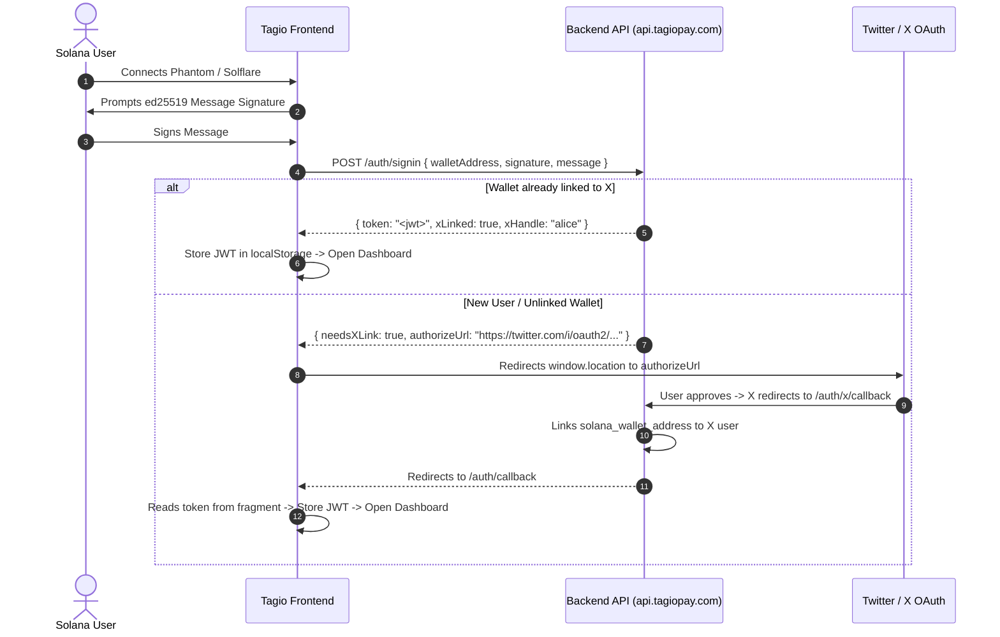

# TagioPay — Complete Frontend Integration & Architectural Specification

> **Core Philosophy**: **"Executed on Solana, Settled on Robinhood"**
>
> TagioPay is a Web3 payment identity, programmable fan-out routing, and tokenized US equities trading platform. Users interact through standard **Solana wallets** (**Phantom**, **Solflare**, **Backpack**) using **SOL** and **USDC**. Complex onchain logic (namespace registry NFTs, percentage payout splits, milestone escrows, causes, private send pool) is settled seamlessly on Robinhood Chain via **Relay.link** intent solvers.

---

## 1. Executive Summary & Brand Positioning

* **Target Ecosystem**: Solana (Fast confirmations, low fees, standard Solana wallet adapters).
* **Working Currencies**: Strictly **`SOL`** (9 decimals) and **`USDC`** (6 decimals).
* **Tokenized Stocks (xStocks)**: 714+ asset-backed US equities & ETFs (Apple, Tesla, NVIDIA, Google, S&P 500) trading natively as Solana SPL tokens (see [`backend/src/lib/rwaTokens.ts`](file:///home/skipp/Documents/gigs/qpay/tagiopay/backend/src/lib/rwaTokens.ts)).
* **Cross-Chain Intent Layer**: **Relay.link** bridges Solana user transactions to Robinhood Chain smart contracts with an automatic **0.15% (15 bps) protocol fee**.
* **Branding Guidelines**: Position TagioPay as an ultra-fast, user-friendly Solana product. Emphasize that programmable rules and namespace ownership settle securely on Robinhood Chain in the background.

---

## 2. Environments & Base Endpoints

| Environment | Base URL |
| :--- | :--- |
| **Live Production API** | `https://api.tagiopay.com` |
| **Local Development API** | `http://localhost:3001` |
| **Production Frontend** | `https://tagiopay.com` |

All requests requiring user authentication must include:
```http
Authorization: Bearer <JWT_TOKEN>
```

---

## 3. Core Architectural Execution Matrix

```
┌────────────────────────────────────────────────────────────────────────┐
│                        TAGIOPAY FRONTEND (SOLANA)                      │
└───────────────────┬────────────────────────────────┬───────────────────┘
                    │                                │
      Direct Send & xStocks Swaps          Contract Calls (Splits/Escrows)
                    │                                │
                    ▼                                ▼
       ┌────────────────────────┐       ┌────────────────────────┐
       │   Solana Native/SPL    │       │ Relay.link (0.15% Fee) │
       │ (SystemProgram / DEX)  │       │     /relay/quote       │
       └────────────────────────┘       └────────────┬───────────┘
                                                     │
                                                     ▼
                                        ┌────────────────────────┐
                                        │ Robinhood Chain L2     │
                                        │ Smart Contracts        │
                                        └────────────────────────┘
```

| Feature / Action | Execution Path | Asset / Currency | Details & Routing |
| :--- | :--- | :--- | :--- |
| **1. Direct Send** | Pure Solana Transfer | SOL / USDC | Native `SystemProgram.transfer` or SPL Token transfer to base58 Solana address. Instant, no bridge/Relay fee. |
| **2. Stock Trading (xStocks)** | Pure Solana DEX (Jupiter) | SOL/USDC ↔ `AAPLx`, `TSLAx` | Direct Solana SPL swap to the respective xStock mint address. Instant settlement, no bridge/Relay fee. |
| **3. Hashtag Send (`#handle`)** | Relay.link Intent Quote | SOL / USDC | Bridges to `HashtagResolver.receivePayment()` on Robinhood Chain with **0.15% fee** for onchain percentage fan-out splits. |
| **4. Register / Renew Handle** | Relay.link Intent Quote | SOL / USDC | Bridges to `HashtagResolver.registerHashtag()` / `renewSubscription()` with **0.15% fee**; mints `HashtagNFT`. |
| **5. Unlinked `@handle` Deposit** | Relay.link Intent Quote | SOL / USDC | Deposits to `ClaimEscrow` with **0.15% fee** until recipient links their X account. |
| **6. Configure Payout Splits** | Relay.link Intent Quote | — | Calls `HashtagResolver.updatePayouts()` to update destination percentages onchain. |
| **7. Freelance Escrow** | Relay.link Intent Quote | SOL / USDC | Locks funds in `SimpleEscrow` with **0.15% fee**; released upon project milestone delivery. |
| **8. Causes & Donations** | Relay.link Intent Quote | SOL / USDC | Deposits to `CauseRegistry` with **0.15% fee**; updates verified donor totals and leaderboards. |
| **9. Private Send (`$psend`)** | Relay.link Intent Quote | SOL / USDC | Locks funds into `PrivateSendPool` with secret commitment and **0.15% fee**; auto-claimed by backend keeper. |
| **10. Mass Airdrops / Giveaways** | Relay.link Intent Quote | SOL / USDC | Batch disperses funds via `BatchDisperser` to hundreds of recipients with **0.15% fee**. |

---

## 4. Complete Feature Modules & UI Pages

### Module 1: Authentication & Dual-Chain Account Binding

TagioPay uses a 2-step verification: **Solana Wallet Signature (ed25519) + X (Twitter) OAuth 2.0 PKCE**.



#### Code Implementation:
```typescript
import bs58 from "bs58";

const SIGNIN_MESSAGE = "Welcome to TagioPay! Please sign this message to verify your wallet ownership.";

export async function signIn(publicKey: PublicKey, signMessage: (msg: Uint8Array) => Promise<Uint8Array>) {
  const encoded = new TextEncoder().encode(SIGNIN_MESSAGE);
  const signatureBytes = await signMessage(encoded);
  const signature = bs58.encode(signatureBytes);

  const res = await fetch("https://api.tagiopay.com/auth/signin", {
    method: "POST",
    headers: { "Content-Type": "application/json" },
    body: JSON.stringify({
      walletAddress: publicKey.toBase58(),
      signature,
      message: SIGNIN_MESSAGE,
    }),
  });

  const data = await res.json();
  if (data.token) {
    localStorage.setItem("tagiopay_auth_token", data.token);
    return { status: "signed_in", xHandle: data.xHandle };
  } else if (data.needsXLink) {
    window.location.href = data.authorizeUrl;
    return { status: "redirecting_to_x" };
  }
}
```

---

### Module 2: Dashboard Overview & Balances
* **Active User Pill**: Shows connected Solana address (`short: 4…4`), linked `@x_handle` badge, and network indicator (`Solana Mainnet`).
* **Live Wallet Balances**: Shows user's real-time **SOL** and **USDC** balance via Solana RPC.
* **Overview Stats**:
  * Total Handles Owned.
  * Inbound / Outbound volume processed.
  * Active escrows & open causes count.

---

### Module 3: Hashtags & Identity Management

* **Availability Search**:
  * Real-time validation: Lowercase alphanumeric + underscores only (`/^[a-z0-9_]{3,32}$/`).
  * Queries `GET /hashtags/check/:name` to show if available or taken.
* **Registration Flow**:
  1. User enters desired hashtag (e.g. `#solbuilder`).
  2. Generates cryptographic **Account Recovery Phrase** (12-word seed / high-entropy phrase committed onchain as `recoveryHash`).
  3. Previews registration cost in SOL / USDC.
  4. Calls `POST /relay/quote` to execute `registerHashtag()` on Robinhood Chain via Relay.link.
  5. Mints `HashtagNFT` onchain to represent permanent ownership.
* **Profile Metadata Editor**:
  * Display Name, Avatar Image URL, Bio Description, Website URL.
  * Social Handles: Twitter/X, Telegram, Discord, GitHub, Email.
* **Subscription & Renewals**:
  * 30-day lease lifecycle with live countdown badge.
  * 72-hour grace period protection before anyone can claim/re-mint an expired handle.
  * One-click "Renew Subscription" button.
* **Cryptographic Recovery Flow**:
  * If a user loses access to their Solana wallet, they can open the **Account Recovery** tab from a new wallet, input `#hashtag` + their recovery phrase, and call `transferViaRecoveryPhrase` to restore ownership to the new wallet without admin approval.

---

### Module 4: Public Hashtag Profile Page (`/h/:hashtag`)

A shareable public URL for creators, DAOs, and freelancers (e.g., `tagiopay.com/h/designteam`):
* **Profile Header**: Avatar, Display Name, `#hashtag`, Verified Twitter/X, Telegram, and Discord badges.
* **Onchain Volume Stats**: Total volume USD processed through this hashtag and active split count.
* **Direct Pay Widget**: Embedded widget allowing anyone to pay the hashtag in **SOL** or **USDC**.
* **Dynamic QR Code**: Generates scan-to-pay QR codes with customizable amounts.

---

### Module 5: Programmable Multi-Wallet Payout Splits

Users can configure how incoming payments to `#hashtag` are divided:
* **Add Recipient Wallets**: Up to 10 destination Solana wallets.
* **Percentage Split Allocations**: Expressed in basis points (e.g. 70.00% = `7000`, 30.00% = `3000`, must total exactly 100.00% / `10000`).
* **Onchain Execution**: Updates `HashtagResolver.sol` onchain. Whenever a client pays `#hashtag`, funds are atomically divided and fanned out in a single transaction.

---

### Module 6: Universal Send Interface

* **Unified Recipient Box**: Automatically detects input type:
  * `#hashtag` → Resolves via `GET /hashtags/resolve/:name` to show recipient avatar, name, and split breakdown.
  * `@handle` → Checks `GET /hashtags/user/:handle`. If unlinked, informs sender that funds will be held in `ClaimEscrow` until the recipient connects their X account.
  * `Base58 Solana Address` → Direct instant transfer.
* **Currency Selector**: Toggle between **`SOL`** and **`USDC`**.
* **Live Route Preview**: Shows gas estimate, 0.15% protocol fee breakdown, and expected arrival time (<2s).

---

### Module 7: Tokenized US Equities & ETFs (714+ xStocks on Solana)

Trade real-world assets natively on Solana via [xStocks.fi](https://xstocks.fi/products):
* **Top Featured Equities**:
  * `AAPLx` (Apple) — `XsbEhLAtcf6HdfpFZ5xEMdqW8nfAvcsP5bdudRLJzJp`
  * `TSLAx` (Tesla) — `XsDoVfqeBukxuZHWhdvWHBhgEHjGNst4MLodqsJHzoB`
  * `NVDAx` (NVIDIA) — `Xsc9qvGR1efVDFGLrVsmkzv3qi45LTBjeUKSPmx9qEh`
  * `GOOGLx` (Google) — `XsCPL9dNWBMvFtTmwcCA5v3xWPSMEBCszbQdiLLq6aN`
  * `AMZNx` (Amazon) — `Xs3eBt7uRfJX8QUs4suhyU8p2M6DoUDrJyWBa8LLZsg`
  * `MSFTx` (Microsoft) — `XspzcW1PRtgf6Wj92HCiZdjzKCyFekVD8P5Ueh3dRMX`
  * `METAx` (Meta) — `Xsa62P5mvPszXL1krVUnU5ar38bBSVcWAB6fmPCo5Zu`
  * `COINx` (Coinbase) — `Xs7ZdzSHLU9ftNJsii5fCeJhoRWSC32SQGzGQtePxNu`
  * `SPYx` (S&P 500 Index) — `XsoCS1TfEyfFhfvj8EtZ528L3CaKBDBRqRapnBbDF2W`
  * `QQQx` (Nasdaq 100 Index) — `Xs8S1uUs1zvS2p7iwtsG3b6fkhpvmwz4GYU3gWAmWHZ`
* **Features**:
  * Buy / Sell tabs against **`SOL`** and **`USDC`**.
  * Real-time quote preview (`POST /swap/quote`).
  * Price impact alert if slippage >3%.

---

### Module 8: Freelance & Milestone Escrow (`SimpleEscrow`)

Bilateral milestone protection for freelancers and clients:

```
[ Client Creates Escrow ] ──> [ Freelancer Accepts ] ──> [ Freelancer Delivers ] ──> [ Client Releases ]
         │                                                        │                            │
   (Locks SOL/USDC)                                      (Submits URL/Work)            (Funds Dispersed)
```

* **Create Escrow**: Client inputs Freelancer wallet / `@handle`, deposit amount (SOL/USDC), project description, and deadline.
* **Accept**: Freelancer reviews terms and clicks "Accept Escrow".
* **Deliver**: Freelancer uploads work or submits delivery URL.
* **Release**: Client verifies work and releases funds.
* **Timeout Protections**:
  * If freelancer fails to deliver before deadline → Client can refund deposit.
  * If client becomes unresponsive after delivery → Freelancer can trigger force-release after review window.

---

### Module 9: Causes & Crowdfunding Registry (`CauseRegistry`)

* **Create a Cause**: Tie a charitable fundraiser to a verified `#hashtag` with a mission title, description, and target goal in USD.
* **Public Donations**: Backers donate SOL or USDC directly from the web app.
* **Live Donor Leaderboard**: Displays top donors, total raised vs goal percentage progress bar, and contributor count.
* **Proof-of-Withdrawal Transparency**: Cause organizers publish onchain transaction proofs and status updates whenever funds are deployed.

---

### Module 10: Shielded Private Send (`PrivateSendPool` / `$psend`)

* **Financial Privacy**: Allows sending funds to any `@handle`, `#hashtag`, or address without linking the sender's wallet to the recipient on public block explorers.
* **Automated Keeper Sweeper**:
  * Senders pay a small upfront keeper fee in SOL/USDC.
  * The backend automated keeper monitors the pool and automatically sweeps the funds to the recipient's wallet—the recipient does not even need to pay gas.
  * Manual claim fallback option if recipient wants to claim immediately.

---

### Module 11: Real-Time Pending Queue & Bot Approvals

* **X Bot Bridge**: When users trigger bot commands on X (e.g. `$send @bob 10 USDC`, `$psend`, `$split`, `$escrow`), the backend stages a `pending_transactions` entry.
* **Live In-App Notification & Modal**:
  * Top navigation displays a pulsing "Pending Requests" badge when requests are waiting.
  * One-click "Review & Confirm" modal allowing the user to sign and broadcast the staged transaction with their Solana wallet.

---

### Module 12: Mass Airdrops & Giveaways (`BatchDisperser`)

* **AI Rule Verification**: Groq-powered intent parser verifies retweets, likes, and follows for giveaways on X.
* **Batch Dispersal**: Organizers deposit the total prize pool, and `BatchDisperser` distributes funds to hundreds of winners in a single transaction.

---

## 5. Relay.link Integration Blueprint

For all smart contract calls (Hashtag register/renew, splits, escrows, causes, private send):

```typescript
// 1. Request Relay Quote from Backend
const quote = await fetch("https://api.tagiopay.com/relay/quote", {
  method: "POST",
  headers: { "Content-Type": "application/json" },
  body: JSON.stringify({
    user: publicKey.toBase58(), // Solana wallet
    originCurrency: "11111111111111111111111111111111", // SOL (or USDC: EPjFWdd5AufqSSqeM2qN1xzybapC8G4wEGGkZwyTDt1v)
    amount: "100000000", // Amount in base units
    txs: [
      {
        to: "0x1326bBA97a060b6c4B445E0dD83342203795725E", // Robinhood Contract Address
        data: "0x...", // Encoded contract call
        value: "0",
      },
    ],
  }),
}).then((r) => r.json());

// 2. Sign and Submit Solana Instructions
// Deserialize quote.steps[0].items[0].data.instructions and execute with @solana/wallet-adapter-react

// 3. Track Status
const pollStatus = async (requestId: string) => {
  const res = await fetch(`https://api.tagiopay.com/relay/intent/${requestId}`);
  const status = await res.json();
  return status; // 'pending' | 'success' | 'refunded'
};
```

---

## 6. Complete REST API Reference

All routes requiring authentication accept `Authorization: Bearer <token>`.

### Authentication & Profiles
* `POST /auth/signin`: Sign in with Solana ed25519 signature or EVM signature.
* `GET /auth/x/callback`: OAuth 2.0 PKCE callback handler.

### Hashtags & Identity
* `GET /hashtags/check/:hashtag`: Check handle availability (`{ available: boolean }`).
* `GET /hashtags/resolve/:hashtag`: Returns resolved address, payout splits, and metadata (<50ms cached).
* `GET /hashtags/user/:walletAddress`: List all hashtags owned by or routing to this wallet.
* `POST /hashtags/confirm-transaction`: Synchronizes onchain registration/renewal events.

### Cross-Chain Relay (0.15% Protocol Fee)
* `POST /relay/quote`: Fetches cross-chain quote from Solana (SOL/USDC) to Robinhood contracts with 0.15% fee.
* `GET /relay/intent/:requestId`: Checks status of cross-chain execution.

### Trading & Swaps
* `GET /tokens`: Directory of supported base currencies (`SOL`, `USDC`) and 714+ Solana xStocks equities.
* `POST /swap/quote`: Price quote and route calculation.
* `POST /swap/plan`: Prepares execution steps for token swaps.

### Escrows & Causes
* `GET /escrows?wallet=:address`: List user's active freelance escrows.
* `GET /escrows/:id`: Get full details and milestone history of an escrow.
* `GET /causes`: List all verified fundraising causes and leaderboard stats.
* `GET /causes/:causeId/leaderboard`: Top donor rankings for a specific cause.

### Private Send & Pending Queue
* `GET /private-sends?wallet=:address`: List user's shielded transactions and keeper sweep statuses.
* `POST /private-sends`: Create a private send transaction.
* `POST /private-sends/:id/claim`: Manual claim fallback for private send.
* `GET /pending-transactions`: List pending bot transactions waiting for user confirmation.
* `POST /pending-transactions/:id/cancel`: Reject and dismiss a pending request.

---

## 7. Namespace & Validation Rules

* **Hashtag Format**: `^[a-z0-9_]{3,32}$` (strictly lowercase, numbers, underscores, 3-32 characters).
* **Payout Splits**: Up to 10 destination wallets; sum of basis points must equal `10000` (100.00%).
* **Lease Duration**: 30 days renewable; 72-hour grace period before public re-registration.
