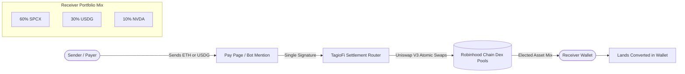

<div align="center">

# 🏷️ TagioFi (TagioPay)

### Non-Custodial Receive-Side Settlement Protocol on Robinhood Chain

[](https://opensource.org/licenses/MIT)
[](https://www.typescriptlang.org/)
[](https://bun.sh/)
[](https://vitejs.dev/)
[](https://getfoundry.sh/)
[-00C805)](https://robinhood.com/)
[](https://groq.com/)
[](https://x.com/tagiofi)

<p align="center">
  <strong>Your tag knows what you want to be paid in.</strong><br/>
  Set your receive-mix once. Inbound payments in ETH or USDG settle atomically into the assets you actually keep — tokenized equities, ETFs, metals, or stables — in a single signature on Robinhood Chain.
</p>

<p align="center">
  <strong>Official Token Contract ($TGIO):</strong><br/>
  <code>0x0866ec4adb5e35c9cbfba9dfb5461d4364897da8</code><br/>
  <a href="https://robinhoodchain.blockscout.com/token/0x0866ec4adb5e35c9cbfba9dfb5461d4364897da8">View on Robinhood Blockscout ↗</a>
</p>

[**Launch Settlement Studio**](https://tagiopay.com/app) · [**Explore Roadmap**](https://tagiopay.com/roadmap) · [**Read Docs**](https://tagiopay.com/site/docs.html) · [**Follow on X (@tagiofi)**](https://x.com/tagiofi)

---

</div>

## 🌟 Key Features

| Feature | Description |
| :--- | :--- |
| **🏷️ Programmable Tag Registry** | Human-readable handles (`@handle` / `#tag`) registered onchain with verified Twitter/X OAuth identities. |
| **⚡ Atomic Receive-Side Settlement** | Senders pay in whatever they hold (ETH/USDG); receivers automatically receive their elected asset mix (up to 8 assets totaling 100%). |
| **🤖 Universal Groq AI Bot (`@TagioPayBot`)** | Natural language intent parser running `qwen/qwen3.8-27b` on Groq LPUs with sub-100ms inference for tips, payments, invoices, and escrows. |
| **🔗 1-Click Pay-Links & Dynamic Invoices** | Shareable payment URLs (`/pay/:handle` & `/pay/:invoiceId`), QR receipts, and merchant checkout. |
| **👥 Multi-Member Split Tags** | Group tags that fan out incoming revenue to multiple collaborators according to basis points, each paid in their own custom mix. |
| **💼 RosterVault Scheduled Payroll** | Smart contract automated payroll disbursements for DAOs, product teams, and businesses. |
| **💎 Sustainable Fee Economics ($TGIO)** | 100% free same-asset fast path; bounded 0.15% conversion fee routing **80% to $TGIO buybacks**, **10% to stakers**, **5% to treasury**, and **5% to core protocol**. |

---

## 🏗️ Architecture & How It Works



1. **Tag & Mix Configuration**: A creator or business registers `@handle` and selects their desired receive portfolio (e.g. 60% SPCX, 30% USDG, 10% NVDA).
2. **Inbound Payment**: A payer sends funds via direct payment link (`tagiopay.com/pay/vlad`), invoice (`/pay/inv_...`), or Twitter mention (`@TagioPayBot send @vlad 50 usdg`).
3. **Atomic Execution**: The settlement router quotes the optimal Uniswap V3 swap paths on Robinhood Chain, applies slippage bounds, and settles the payment into the receiver's portfolio in **one atomic transaction**. Zero balances are ever custodied.

---

## 📁 Repository Structure

```text
tagiopay/
├── src/                  # Frontend: Vite + TanStack Start/Router + Tailwind CSS v4 + Wagmi
│   ├── components/       # UI Components (Studio, AllocationBar, SpotlightCard, AuthGate)
│   ├── hooks/            # TanStack Query & Wagmi Hooks (useTagioV2, useTagioAuth)
│   ├── routes/           # File-based Routes (/, /app, /roadmap, /pay/$target, /auth/callback)
│   └── types/            # TypeScript Domain Models & Contract Interfaces
│
├── backend/              # Backend: Bun + Express + PostgreSQL + Redis
│   ├── src/v2/           # V2 API (Handles, Elections, Invoices, Groq AI Intent Parser)
│   ├── src/v1/           # V1 Bot Engine (X Mentions Poller, DM Poller, Tx Builders)
│   └── db/migrations/    # PostgreSQL Schema Migrations (001 - 014)
│
├── contracts/            # Smart Contracts: Foundry (Solidity 0.8.24)
│   ├── src/              # HashtagResolver, HashtagNFT, SimpleEscrow, ClaimEscrow, BatchDisperser
│   └── test/             # Comprehensive Foundry Unit & Fuzz Tests
│
├── scripts/              # Automation & Multi-Repo Synchronization Utilities
│   └── sync-public.py    # Byte-exact author rewriting for open-source repository
│
└── technical-docs/       # Internal Product Specs, PRDs, & Architecture Guides (untracked)
```

---

## 🚀 Quick Start

### Prerequisites
- [Bun](https://bun.sh/) `v1.3+`
- [Node.js](https://nodejs.org/) `v20+`
- [Foundry](https://getfoundry.sh/) (for smart contract tests)
- PostgreSQL & Redis (for backend services)

---

### 1. Frontend Development

```bash
# Install dependencies
bun install

# Start local development server
bun dev

# Run typechecks and production build
bun run check
bun run build
```

---

### 2. Backend Development

```bash
cd backend

# Install backend dependencies
bun install

# Configure environment variables
cp .env.example .env

# Run database migrations
bun run migrate

# Run unit tests
bun test

# Start backend server
bun dev
```

---

### 3. Smart Contracts (Foundry)

```bash
cd contracts

# Install Foundry dependencies
forge install

# Build contracts
forge build

# Run unit and fuzz test suite
forge test -vvv
```

---

## 🌐 Network & Deployed Contracts

| Parameter | Value |
| :--- | :--- |
| **Network** | Robinhood Chain Mainnet |
| **Chain ID** | `4663` |
| **Currency** | `ETH` |
| **Official Token ($TGIO)** | [`0x0866ec4adb5e35c9cbfba9dfb5461d4364897da8`](https://robinhoodchain.blockscout.com/token/0x0866ec4adb5e35c9cbfba9dfb5461d4364897da8) |
| **Explorer** | [robinhoodchain.blockscout.com](https://robinhoodchain.blockscout.com) |
| **Native Stablecoin** | `USDG` (`0x5fc5360D0400a0Fd4f2af552ADD042D716F1d168`) |
| **Supported RWA Equities** | `SPCX`, `AAPL`, `NVDA`, `TSLA`, `GOOGL`, `AMZN`, `MSFT`, `META`, `COIN` |

---

## 🌐 Community & Official Links

* **Official X / Twitter**: [@tagiofi](https://x.com/tagiofi) (`https://x.com/tagiofi`)
* **TagioFi Bot on X**: [@TagioPayBot](https://x.com/TagioPayBot) (`https://x.com/TagioPayBot`)
* **Settlement Studio**: [tagiopay.com](https://tagiopay.com)
* **Facebook Bot Waitlist**: [tagiopay.com/facebook](https://tagiopay.com/facebook)
* **Official Token ($TGIO)**: [`0x0866ec4adb5e35c9cbfba9dfb5461d4364897da8`](https://robinhoodchain.blockscout.com/token/0x0866ec4adb5e35c9cbfba9dfb5461d4364897da8)

---

## 🛡️ Security & Disclosures

* **Non-Custodial Guarantee**: Smart contracts never take custody of funds. All routing occurs atomically within single-transaction execution boundaries.
* **Slippage & Price Sanity**: Leg-level slippage bounds and price sanity checks protect each conversion. If an asset experiences liquidity constraints, it safe-settles into USDG with an onchain event log.
* **Security Disclosures**: Please see [`SECURITY.md`](./SECURITY.md) for our vulnerability reporting policy and bug bounty details.

---

## 📄 License

This project is licensed under the **MIT License** — see the [`LICENSE`](./LICENSE) file for details.
