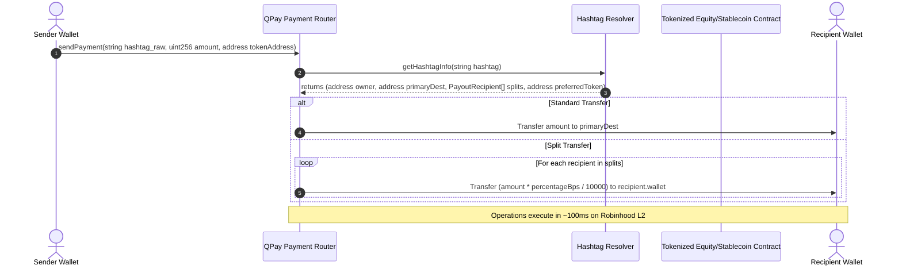

# Product Requirements Document (PRD)
## QPAY Onchain Hashtag Technology — Robinhood Chain Identity Layer

| Attribute | Details |
| :--- | :--- |
| **Document Version** | 1.0.0 |
| **Status** | Draft (Pending Review) |
| **Author** | Antigravity AI Coding Assistant |
| **Focus** | Onchain Hashtag Registry & Resolver System |
| **Target Network** | Robinhood Chain (EVM Layer-2 via Arbitrum Stack) |

---

## 1. Executive Summary

This document specifies the core **Hashtag Technology** for QPAY on the Robinhood Chain. The system replaces standard cryptographic hex addresses with human-readable, programmable onchain handles (e.g., `#linda` or `#finance`). 

On the Robinhood Chain, hashtags serve as the universal identity layer for resolving routing destinations, payout structures, and asset preferences. This document outlines the technical requirements for the Hashtag Registry, Hashtag Resolver, multi-asset payment routing, and metadata integration on the Robinhood Layer-2 network.

---

## 2. Core Identity Specs & Namespace Rules

To maintain consistency and avoid routing errors, all hashtags registered on the Robinhood Chain must adhere to the following namespace rules:

1. **Format:** Preceded by `#` in user interfaces, but stored onchain as a normalized, lowercase alphanumeric string (e.g., `#payUs` is normalized to `payus`).
2. **Length Constraints:** Minimum of 3 characters, maximum of 32 characters.
3. **Character Set:** Regex `^[a-z0-9_]{3,32}$` (only lowercase letters, numbers, and underscores). No special characters or spaces.
4. **Uniqueness:** Namespace is global on the Robinhood L2; once `payus` is minted, it cannot be registered by another wallet until it expires or is transferred.

---

## 3. Onchain Registry & Token Architecture (ERC-721)

Every onchain hashtag is represented as a unique non-fungible token (NFT) using the ERC-721 standard on the Robinhood Chain.

### 3.1 Hashtag Ownership & State
* **NFT Representation:** The Token ID is the `uint256` representation of the `keccak256` hash of the normalized hashtag string.
* **Lease Mechanics:** Hashtags are registered under a lease model (e.g., 1-year registration period) to prevent namespace squatting.
* **State Variables per Hashtag:**
  * `registeredAt` (timestamp)
  * `expiresAt` (timestamp)
  * `owner` (address)
  * `active` (boolean)

### 3.2 Registry Functions
* **`registerHashtag(string hashtag, uint256 duration)`**: Checks availability, calculates fee, mints the ERC-721 token to the sender, and stores initial timestamps.
* **`renewHashtag(string hashtag, uint256 extensionDuration)`**: Extends the `expiresAt` timestamp. Can be called by anyone (to sponsor/renew a tag) but benefits the current owner.
* **`transferHashtag(address to, string hashtag)`**: Uses the standard ERC-721 `safeTransferFrom` to change ownership. Automatically updates the owner record in the resolver.

---

## 4. Programmable Resolver & Metadata Specs

The `HashtagResolver` contract maintains the routing, social metadata, and payout distribution configuration for each hashtag.

### 4.1 Resolution Target Mappings
Each hashtag resolves to a set of destination targets:
* **Primary Destination:** The default EVM address where funds are routed.
* **Social Handlers:** Verification links to Web2/Web3 social handles:
  * `twitter` / `x` handles
  * `telegram` usernames
  * `discord` IDs
* **Asset Preferences:** Preferred settlement token (e.g., native ETH, USDC, or specific tokenized stock/ETF tokens native to the Robinhood L2 ecosystem).

### 4.2 Programmable Payout Splits (Multi-Recipient Routing)
A key feature of the hashtag technology is its ability to route payments to multiple recipient wallets automatically.
* **Split Configuration:** Stored as an array of structs containing target wallets and basis points (bps, where `10000 = 100%`).
  ```solidity
  struct PayoutRecipient {
      address wallet;
      uint16 percentageBps; // e.g., 5000 = 50%
  }
  ```
* **Validation:** The sum of all `percentageBps` in a hashtag's payout split configuration must equal exactly `10000` (100%).

---

## 5. Payment Routing Flow & API Integration

The `QPayPaymentRouter` contract utilizes the resolver data to execute swaps and transfers.



### 5.1 Resolver Contract Interface
```solidity
interface IHashtagResolver {
    struct PayoutRecipient {
        address wallet;
        uint16 percentageBps;
    }

    struct SocialLink {
        string key;     // e.g. "twitter", "telegram"
        string value;   // e.g. "@linda"
    }

    function getHashtagInfo(string calldata hashtag) external view returns (
        address owner,
        address primaryDestination,
        PayoutRecipient[] memory payouts,
        SocialLink[] memory socials,
        uint256 registeredAt,
        uint256 expiresAt,
        bool active
    );
    
    function setPrimaryDestination(string calldata hashtag, address destination) external;
    function setPayouts(string calldata hashtag, PayoutRecipient[] calldata newPayouts) external;
    function setSocials(string calldata hashtag, SocialLink[] calldata newSocials) external;
}
```

---

## 6. Integrations & Performance Specs

### 6.1 Low Latency Resolution (L2 Performance)
Because the Robinhood Chain is built on the Arbitrum Nitro stack, the backend API client must perform resolution operations directly against RPC providers with minimal overhead:
* **Resolution API Endpoint:** `GET /hashtags/resolve/:hashtag`
* **Performance Requirement:** Read operations from the L2 RPC node must return resolver data in under **50ms**.
* **Caching:** Cache resolution targets in Redis (expiring after 60 seconds) to bypass RPC rate-limits during high-velocity social events.

### 6.2 Offchain Listening & Verification Bot Layer
Social bots (e.g., Telegram and X) utilize the resolution API to link user mentions to addresses:
1. **Verification Handshake:** To associate a Twitter handle with a hashtag, the owner must sign a message using their wallet:
   ```text
   Verify hashtag #finance ownership for Twitter account @linda
   ```
2. **Social Binding:** The signed signature is submitted to the contract or verified off-chain via the API to unlock the social tag resolution features.

---

## 7. Open Questions & Risks

> [!WARNING]
> **Namespace Collisions with Other Chains:** If QPAY operates on Solana, Base, and Robinhood Chain simultaneously, how are hashtag collisions prevented? We must establish either:
> * A cross-chain registration synchronizer (using Chainlink CCIP or equivalent).
> * Chain-specific suffixes (e.g., resolving `#name.sol` vs `#name.rh`).

> [!IMPORTANT]
> **Metadata Size & Gas Costs:** Storing dynamic arrays of social handles and payout recipient structures directly onchain can increase gas fees during updates. The resolver contracts should support storing IPFS/decentralized storage URIs for non-routing metadata (like logos or social links) to keep gas usage optimal.
