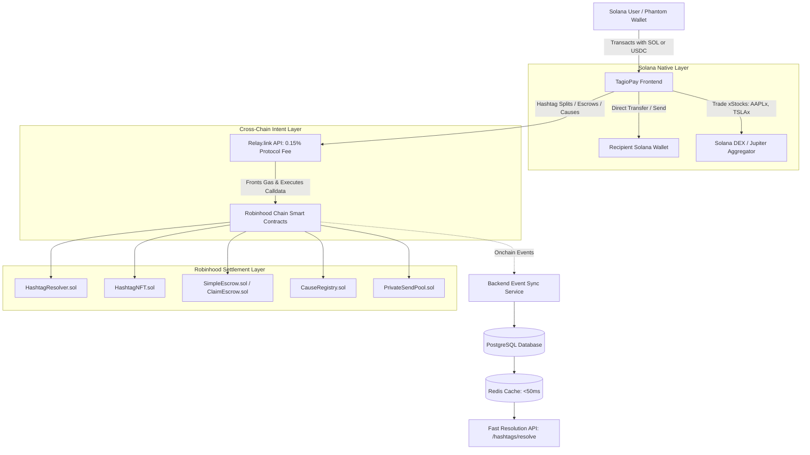

# TagioPay System Architecture & Technical Specification

## 1. System Overview

**TagioPay** is a decentralized identity, programmable payment routing, and tokenized stock trading protocol. It combines an ultra-fast **Solana-native user experience** with deep **Robinhood Chain EVM settlement** via **Relay.link** intent solvers.

TagioPay replaces cumbersome base58 / hex wallet addresses with human-readable `#hashtag` identifiers (e.g., `#alice`, `#teamfund`). Each hashtag functions as an onchain identity that resolves to configurable payout fan-out splits, verified Web2/Web3 social metadata, and account recovery configurations.



---

## 2. Working Base Currencies & Asset Standards

* **Base Working Currencies**: **`SOL`** (Native) and **`USDC`** (SPL) are strictly the only two settlement base currencies exposed across the interface.
* **Tokenized Stocks (xStocks)**: Sourced from [xStocks.fi](https://xstocks.fi/products), over 700 1:1 asset-backed tokenized US equities and ETFs (e.g., `AAPLx`, `TSLAx`, `NVDAx`, `GOOGLx`, `SPYx`, `QQQx`) trade natively on Solana SPL.
* **Settlement Engine**: Contracts deployed on Robinhood Chain (Arbitrum Nitro L2) preserve underlying state, NFT ownership, and payout fan-out rules.

---

## 3. Smart Contract Architecture (Robinhood Chain)

The smart contract suite lives in [`contracts/src`](file:///home/skipp/Documents/gigs/qpay/tagiopay/contracts/src):

### 3.1 Core Identity & Routing
* **[`HashtagNFT.sol`](file:///home/skipp/Documents/gigs/qpay/tagiopay/contracts/src/HashtagNFT.sol)**: ERC-721 token representing hashtag ownership. Token ID is derived from `uint256(keccak256(bytes(hashtag)))`. Minting, burning, and force-transfers are restricted to `HashtagResolver`.
* **[`HashtagResolver.sol`](file:///home/skipp/Documents/gigs/qpay/tagiopay/contracts/src/HashtagResolver.sol)**: Single source of truth for hashtag ownership derived from `HashtagNFT.ownerOf()`.
  * **Fan-Out Splits**: Accepts payments and splits them across an array of up to 10 `PayoutConfig` wallets (must sum to `10,000` basis points).
  * **Lifecycle**: 30-day registration duration with a 72-hour grace period before public re-registration/reclaim.
  * **Recovery**: Pre-committed `recoveryHash` allows re-assigning handle ownership from any new wallet via `transferViaRecoveryPhrase`.

### 3.2 Auxiliary Protocols
* **[`SimpleEscrow.sol`](file:///home/skipp/Documents/gigs/qpay/tagiopay/contracts/src/SimpleEscrow.sol)**: Bilateral Create → Accept → Deliver → Release escrow with automatic timeout safety nets.
* **[`ClaimEscrow.sol`](file:///home/skipp/Documents/gigs/qpay/tagiopay/contracts/src/ClaimEscrow.sol)**: Offchain attestation escrow holding funds destined for unlinked X handles until they connect a wallet.
* **[`BatchDisperser.sol`](file:///home/skipp/Documents/gigs/qpay/tagiopay/contracts/src/BatchDisperser.sol)**: High-efficiency mass payout disperser for airdrops and giveaways.
* **[`CauseRegistry.sol`](file:///home/skipp/Documents/gigs/qpay/tagiopay/contracts/src/CauseRegistry.sol)**: Public donation registry with donor leaderboards and proof-of-withdrawal URLs.
* **[`PrivateSendPool.sol`](file:///home/skipp/Documents/gigs/qpay/tagiopay/contracts/src/PrivateSendPool.sol)**: Shielded transfer pool hiding sender identity from recipients via automated backend keeper claims.

---

## 4. Relay.link Cross-Chain Intent & Fee Architecture

To allow Solana users to interact with Robinhood contracts without holding ETH or switching networks:

1. **Quote Construction (`POST /relay/quote`)**:
   - Origin: Solana (Chain ID `792703809`, tokens: SOL / USDC).
   - Destination: Robinhood Chain (Chain ID `13746`).
   - Calldata: Packed execution calls (`txs`) for target contracts.
   - **Protocol Fee**: A **0.15% fee** (`bps: 15`) is attached to all Relay quotes, credited to the TagioPay fee wallet.
2. **Intent Execution**: Relay market-maker solvers front destination assets, execute the Robinhood contract call within seconds, and emit onchain receipts.

---

## 5. Database Schema & Dual-Chain Account Binding

PostgreSQL migrations allow binding **both a Solana wallet and an EVM wallet** to a single X account:

```sql
-- Migration 012: x_accounts structure
CREATE TABLE x_accounts (
  wallet_address         TEXT PRIMARY KEY REFERENCES users(wallet_address) ON DELETE CASCADE,
  solana_wallet_address  TEXT UNIQUE,
  evm_wallet_address     TEXT UNIQUE,
  x_user_id              TEXT NOT NULL UNIQUE,
  x_handle               TEXT NOT NULL,
  linked_at              TIMESTAMPTZ NOT NULL DEFAULT now()
);
```

---

## 6. Frontend Architecture

* **Framework**: Vite + TanStack Start & Router for type-safe routing.
* **Solana Provider**: `@solana/wallet-adapter-react` + `@solana/wallet-adapter-react-ui` with Phantom and Solflare adapters.
* **Auth**: ed25519 signature verification on Solana (`signInWithSolana`) and OAuth2 PKCE linking with X.
* **Stock Trading**: Native integration with 714+ Solana xStocks from [`rwaTokens.ts`](file:///home/skipp/Documents/gigs/qpay/tagiopay/backend/src/lib/rwaTokens.ts).
